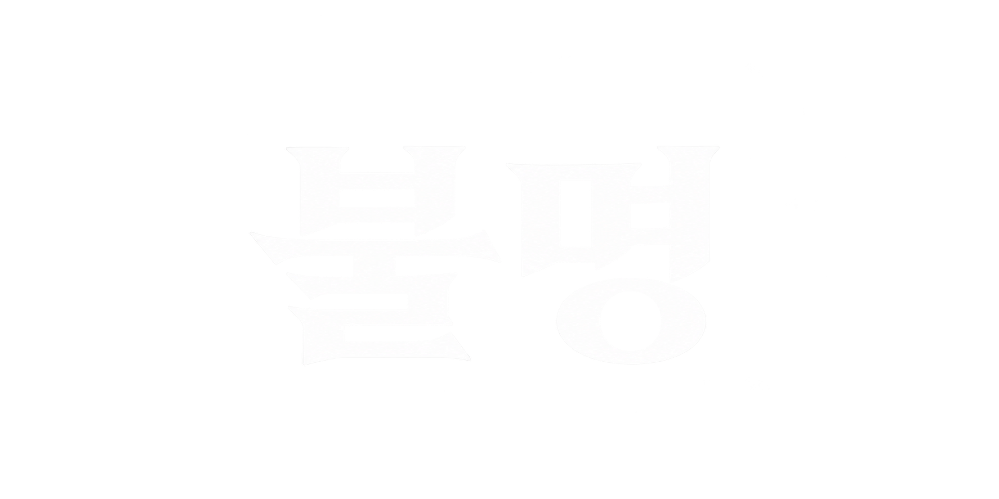
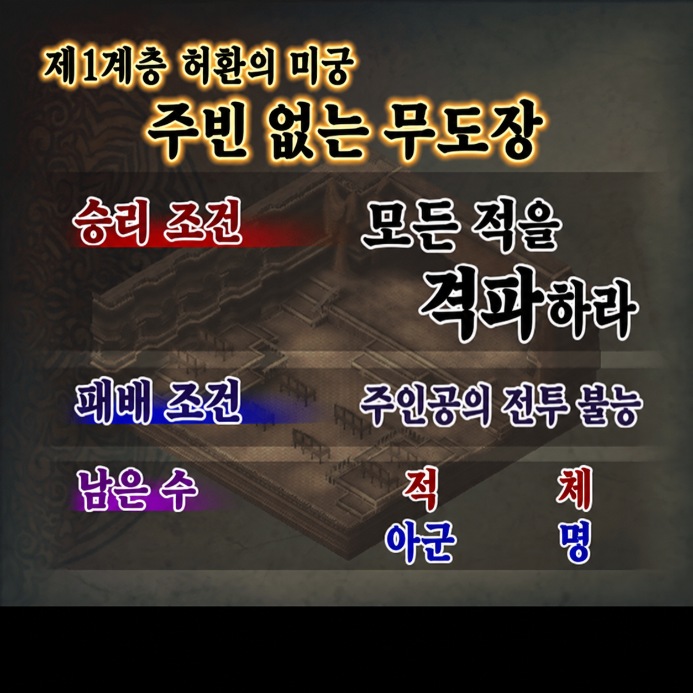

# Poison Pink 한국어화 프로젝트

> [!WARNING]
> **아직 완전 한글화가 아닌 테스트 개발판입니다.** 미번역 이미지와 추가 검수가 필요한 문장·음성이 남아 있으며, 전체 구간의 실제 플레이 검증이 끝난 완성판이 아닙니다. 세이브를 백업하고 이용해 주세요.

PlayStation 2용 일본판 **Poison Pink**의 텍스트, UI 이미지, 지도, 영상과 전투 음성을 한국어로 즐길 수 있도록 연구하고 패치하는 비공식 팬 프로젝트입니다. 원본 게임 데이터는 배포하지 않으며, 정품 일본판 디스크 이미지에 적용하는 xdelta 차분 패치만 Release에서 제공합니다.

## 최신 개발판

**v0.3.0-dev · 전투 음성 한국어 자막 테스트 v3**

- 기존 대사·UI·지도·영상 자막과 독립 실행 대화 레이아웃 수정 유지
- 중복 제거 전투 음성 592종 중 410종, 실제 456개 뱅크 슬롯에 한국어 자막 추가
- 무음·신음·비언어 기합 102종 제외
- 인식 결과가 불확실한 80종은 자막 적용 보류
- 맵/전투 애니메이션 음성 재생에 연결해 2~4초 표시, 다음 번역 발화가 기존 자막 갱신
- 행동 순서 아이콘을 피하도록 자막 Y 좌표를 330으로 조정
- 외부 `.pnach`, `.iso.pcsx2`, 호환 ZIP 없이 실행

| 지역명 이미지 | 지도 이미지 |
|---|---|
|  |  |

## 다운로드와 적용

1. 이 저장소의 [Releases](https://github.com/Jungsik-won/Poison-Pink-Korean-Translation/releases)에서 `Poison_Pink_Korean_battle_subtitles_v3.xdelta`를 받습니다.
2. 본인이 소유한 일본판 ISO의 SHA-256이 아래 원본 해시와 일치하는지 확인합니다.
3. [xdelta3](https://github.com/jmacd/xdelta)를 설치합니다.
4. Release의 자동 적용 스크립트 또는 아래 명령을 사용합니다.

```bash
xdelta3 -d -s "Poison Pink (Japan).iso" \
  "Poison_Pink_Korean_battle_subtitles_v3.xdelta" \
  "Poison Pink (Japan) - Korean battle subtitles v3.iso"
```

macOS/Linux에서는 `scripts/apply_patch_ko.sh`, Windows PowerShell에서는 `scripts/apply_patch_ko.ps1`을 사용할 수 있습니다. 두 스크립트 모두 원본·패치·출력 해시를 확인하며 기존 출력 파일을 덮어쓰지 않습니다.

### 검증값

| 항목 | 값 |
|---|---|
| 지원 원본 | Poison Pink 일본판 ISO |
| 원본 ISO 크기 | 4,245,454,848 bytes |
| 원본 SHA-256 | `081e5c921fc2b0f517f007dfe053935578174a6880949de961e273426b216103` |
| xdelta 크기 | 316,602,347 bytes |
| xdelta SHA-256 | `5ad0db6f2ef2b993c07635ea9f0dc9ce192a5e63f891059fbc8990d61abe8d9e` |
| 출력 ISO 크기 | 4,245,454,848 bytes |
| 출력 SHA-256 | `8ba7111a988b095902e727f089bdf5ac12778c59cfeb127e193402ce17a888b9` |
| 출력 ELF CRC | `0A6FFA91` |

패치 적용 후 ISO가 약 4.25GB인 것은 에뮬레이터가 읽을 수 있는 **완전한 디스크 이미지 전체를 재구성**하기 때문입니다. 다운로드하는 xdelta 파일 자체는 약 302MiB이며, 완성 ISO와 원본 ISO를 동시에 보관하면 저장 공간이 두 배가량 필요합니다.

## 전투 음성 자막의 범위

자막은 일본어 음성 인식 결과와 기존 한국어 용어를 대조해 검토했습니다. **사람이 592종의 원음 전체를 직접 청취한 검수는 아닙니다.** 인식 결과가 불분명하거나 서로 충돌한 80종은 억지로 번역하지 않고 보류했습니다. 짧은 기합·신음·무음 등 비언어 음성 102종도 표시하지 않습니다.

번역이 확정된 음성이 재생되면 자막이 2~4초 동안 표시되고, 그 사이 다음 번역 발화가 나오면 새 문구로 갱신됩니다. 맵과 전투 애니메이션의 음성 재생 경로에 연결되어 있으며 시험용 강제 재생 helper는 최종 ISO에 포함하지 않았습니다.

### 2026-10-01 제한적 실행 검증

- 생성된 MIPS 명령 실행 시험 4개 통과: 592개 음성 매칭, 잘못된 descriptor 범위 거부, 타이머/리셋, 새 ELF 세그먼트와 heap 배치
- 최종 v3 ISO를 PCSX2 2.6.3 Software 4:3, 외부 패치 OFF로 새로 부팅하고 RAM의 코드·문구·좌표 확인
- 동일 코드의 이전 프로토타입 v1에서 정상 메모리카드 사본 불러오기, 전투 준비, 전투 맵, 마법 대상 UI 확인
- 복사 실행 상태에서 게임 음성 재생 함수를 한 번 호출해 `가거라!`, `조디아여!` 자막의 연결·글꼴·종료 확인
- 자연스럽게 조작한 공격으로 최종 자막을 확인한 것은 아니며, 전체 게임·Metal 전투·실제 PlayStation 2는 미검증

새 ISO로 완전히 부팅한 뒤 게임 내 메모리카드 저장을 사용하세요. 이전 강제 상태저장은 옛 실행 코드와 화면 좌표를 복원할 수 있으므로 사용하지 마세요. 원본 사용자 상태저장 1은 변경하지 않았으며 시험용 사본도 원본과 해시가 같음을 확인했습니다. 상세 기록은 [`reports/battle_voice_subtitles_v1.json`](reports/battle_voice_subtitles_v1.json)에 있습니다.

## 개발 자료와 재빌드 전제조건

- `localization/battle_voice_subtitles_v1.json` — 자막 적용·보류·비언어 분류 카탈로그
- `localization/battle_voice_phrases.json` — 검토된 일본어/한국어 표현 사전
- `outputs/battle_voice_subtitles_v1/voice_review.tsv` — 592종 검토표
- `tools/build_battle_subtitles.py` — ELF 세그먼트·hook·자막 테이블 빌더
- `tools/test_battle_subtitles.py` — 생성 MIPS 명령 실행 시험

소스 빌더의 재실행에는 정품 원본에서 로컬로 추출한 게임 자산, 이전 독립 실행 기반 빌드, 기존 한글화 파이프라인에서 만든 글꼴 매핑 자료가 필요합니다. 음성 재인식에는 별도 `whisper.cpp` 실행 파일과 로컬 모델도 필요합니다. `reports/system_messages_v1.json` 같은 글꼴 매핑 원자료와 게임 원본·추출물·기반 ISO·음성 인식 모델은 공개 배포물에 포함하지 않습니다. Release의 xdelta 적용에는 이 개발 전제조건이 필요하지 않습니다.

## 현재 알려진 한계

- 전체 게임의 처음부터 끝까지 실제 플레이 검증이 끝나지 않았습니다.
- 전투 음성 80종은 인식 결과가 불확실해 자막을 보류했습니다.
- 모든 음성을 사람이 직접 청취해 확인한 검수본이 아닙니다.
- 일부 이미지와 문맥 의존 문장, 영상 가사는 추가 번역·검수가 필요합니다.
- 다른 PCSX2 버전, Metal 전투, 실제 PlayStation 2, 모든 분기·시설·엔딩은 미검증입니다.

## 저장소 구성

- `localization/` — 번역 DB, 전투 음성 카탈로그, 용어집과 파이프라인 상태
- `artwork/` — 최신 지역명 11종과 지도 한국어 이미지
- `tools/` — 추출·분석·빌드·검증 도구
- `review/latest/` — 최신 전체 대사 검수본과 수정 내역
- `outputs/battle_voice_subtitles_v1/` — 공개 검토표와 안내
- `reports/` — 최신 빌드 및 검증 보고서
- `docs/DEVELOPMENT_HANDOVER.md` — 다음 작업을 이어가기 위한 상세 인계 문서
- `release/` — 적용 안내, 해시, 배포 매니페스트

## 배포 원칙

- 원본 또는 수정 ISO, 추출한 원본 게임 자산, 음성 WAV/AGS, 영상·음악, BIOS, RAM, 상태저장·메모리카드는 저장소와 Release에 포함하지 않습니다.
- 패치는 이용자가 소유한 정품 일본판에만 적용해야 합니다.
- 게임과 관련 상표·저작권은 각 권리자에게 있습니다. 본 프로젝트는 비공식·비영리 팬 작업입니다.
